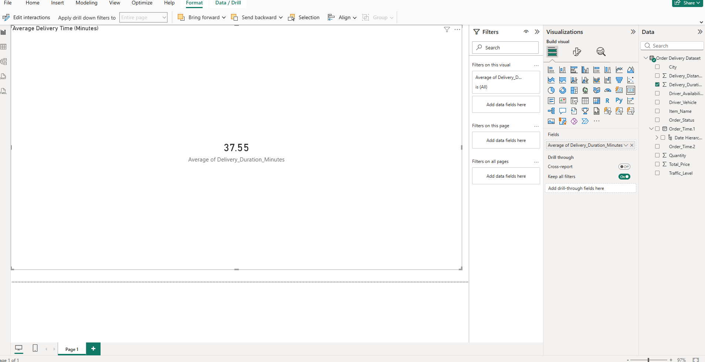
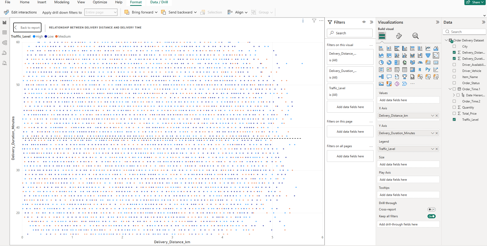
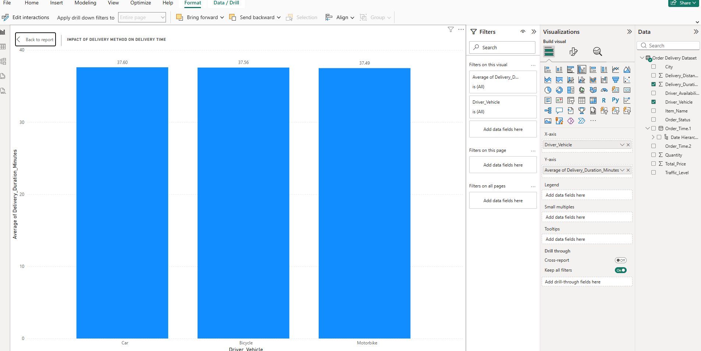
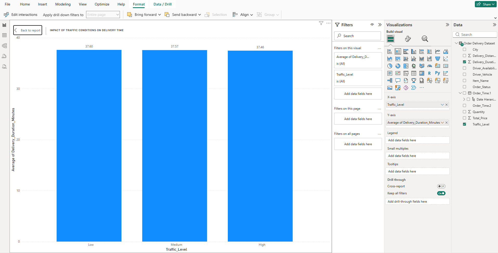

# 🚚 Delivery Performance Analysis

> *A case study based on a food delivery platform inspired by Deliveroo.*

This project analyses delivery performance data to identify the main factors behind late deliveries and provide practical insights for improving operational efficiency.

---

## 🎯 Business Problem

Late deliveries can reduce customer satisfaction and affect operational performance. The aim of this project was to understand the main causes of delays and explore how predictive analytics can help identify high-risk deliveries earlier.

---

## 🛠️ Solution

A data-driven approach was used to analyse delivery patterns, uncover operational inefficiencies, and build predictive models to identify deliveries more likely to arrive late.

---

## 📊 Key Insights

- Delivery distance and traffic conditions were key contributors to delays  
- Longer delivery times were often linked to high traffic levels and operational inefficiencies  
- Certain patterns in delivery behaviour highlighted opportunities for process improvement  

---

## 🛠️ Tools & Technologies

- Python (data analysis and modelling)  
- Excel (data cleaning and preparation)  
- Power BI (data visualisation)  
- Machine Learning (Logistic Regression, Random Forest, XGBoost)  

---

## 🔑 Key Variables Analysed

The analysis focused on operational and delivery-related factors that are likely to influence delays, including:

- Delivery distance  
- Traffic conditions  
- Delivery method  
- Average delivery time  
- Order and operational patterns

---

## ⚙️ Methodology

- Data collection from delivery-related datasets  
- Data cleaning and preparation using Excel and Python  
- Exploratory data analysis (EDA) to identify trends and patterns  
- Model development using classification algorithms  
- Model evaluation using F1-score and ROC-AUC  

---

## 📈 Model Performance

- **Logistic Regression** served as the baseline model for comparison  
- **Random Forest** showed stronger predictive performance by capturing non-linear patterns in the data  
- **XGBoost** delivered the best overall performance, making it the most effective model for identifying late deliveries  

---

## 💼 Business Impact

The insights from this analysis can help improve delivery efficiency by identifying key delay factors.  
These findings can support better route planning, resource allocation, and overall service improvement.

## 📊 Visual Insights  

### 🚚 Average Delivery Time  
  
The average delivery time provides a useful benchmark for overall performance. Variations around this average suggest that some deliveries are affected by operational or environmental factors that increase the risk of delays.

---

### 📍 Delivery Distance vs Time  
  
There is a visible relationship between delivery distance and delivery time. As distance increases, delivery duration generally increases as well, although the spread suggests that traffic and operational factors also influence performance.

---

### 🛵 Delivery Method  
  
Different delivery methods appear to perform differently, which suggests that the delivery allocation strategy can affect overall efficiency and may need to be reviewed.

---

### 🚦 Traffic Condition  
  
Traffic conditions clearly affect delivery performance. Higher traffic levels are associated with longer delivery times, highlighting the importance of route planning and timing.

---

## 🔍 Conclusion & Key Findings

The analysis showed that late deliveries are influenced by a combination of delivery distance, traffic conditions, and operational factors.

Longer distances were generally associated with longer delivery times, while traffic congestion increased the likelihood of delays. The modelling results also showed that more advanced methods, such as Random Forest and XGBoost, were better at capturing these delivery patterns than a baseline Logistic Regression model.

Overall, the project shows how analytics and machine learning can be used not only to understand delivery performance but also to support more proactive and efficient operational decision-making.

---

## 💡 Business Recommendations

- Use traffic and distance data to improve route planning  
- Prioritise early intervention for deliveries identified as high risk  
- Review delivery allocation methods to improve consistency  
- Monitor operational performance regularly to detect changing patterns  
- Use predictive outputs to support faster decision-making during peak periods  
   
---

## ⚠️ Limitations

- The dataset does not include external factors such as weather conditions  
- The data may not fully reflect real-time operational changes  
- Model performance may vary when applied to different datasets
  
---

## 🚀 Future Improvements

- Include additional variables such as weather and real-time traffic data  
- Test the models on larger and more diverse datasets  
- Explore more advanced modelling techniques  
- Develop a real-time monitoring system for delivery performance

---
This project demonstrates my ability to combine data analysis, machine learning, and business insight to solve a real operational problem.
